# Projet d'Application Mobile avec React Native et API personnalisée

## Introduction

Bienvenue dans la documentation de mon projet visant à créer une application mobile interactive qui communique avec une API sur Internet.
L'objectif principal de cette application est de permettre aux utilisateurs de transformer des phrases comme si elles étaient prononcées par des personnages fictifs tels que Yoda, les minions, des pirates, etc.
De plus, l'application doit offrir la fonctionnalité de visualiser l'historique des requêtes effectuées.

L'objectif principal de ce projet est de répondre à diverses contraintes, notamment la navigation à travers plusieurs vues, la gestion des comptes utilisateurs avec sauvegarde des données, l'utilisation des périphériques du téléphone (tels que l'appareil photo, le GPS, l'accéléromètre, etc.), l'intégration de périphériques externes, et enfin, l'interaction avec un site web ou un service web.

## Développement

### Technologies Utilisées
- **React Native**: Framework de développement d'applications mobiles.
- **Node.js et Express.js**: Permet la communication entre l'app et la base de donnée
- **MongoDB**: Système de gestion de base de données NoSQL.
- **Fun Translations API**: Utilisé pour transformer les phrases

### Gestion des Comptes Utilisateurs

Lorsque l'application est lancée, un écran de connexion/inscription apparaît.
Á cette étape-ci, l'utilisateur doit se connecter ou s'inscrire s'il n'a pas de compte.
L'utilisateur sera identifié avec son pseudo.
Et son mot de passe sera composé que de chiffre.

  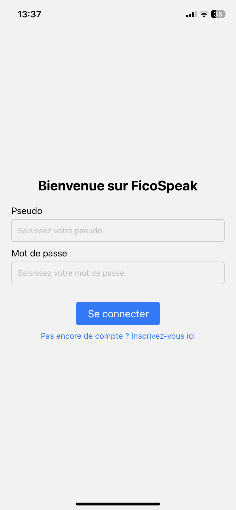
  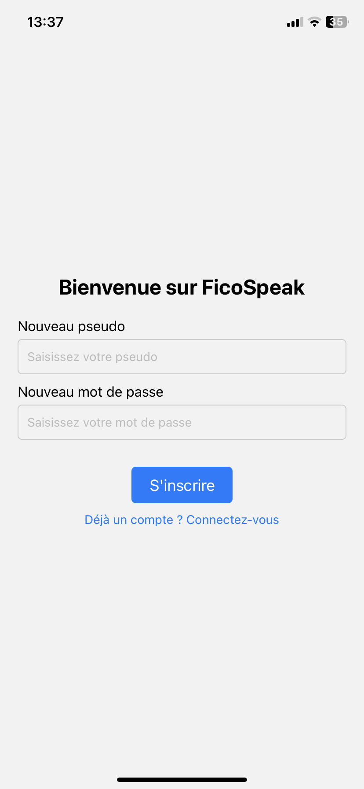

Si un utilisateur veut se connecter, il doit taper son pseudo et son mot de passe.
Par contre, si c'est un nouveau utilisateur, il doit s'inscrire.
Pour cela il doit informer l'application qu'il n'a pas encore de compte en appuyant sur le texte '**Pas encore de compte? Inscrivez-vous ici**'. Lorsque l'utilisateur appuie sur ce lien, il passe à un écran qui lui demande son nouveau pseudo et son nouveau mot de passe.

  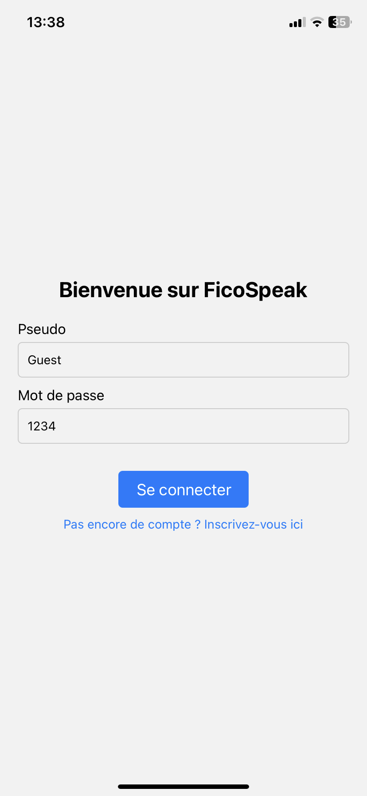

Lorsqu'il tape son pseudo et son mot de passe, l'application mobile procède à une vérification.
Pour cela, l'application demande à la base de donnée si l'utilisateur existe, et si c'est bien son mot de passe qu'il l'a écris.
Et si l'utilisateur a un compte et qu'il a tapé son mot de passe, alors il pourra entrer dans l'accueil de l'application mobile.

### Utilisation des Périphériques du Téléphone

En ce qui concernce le périphérique, il est utilisé lorsque l'utilisateur tape un mauvais mot de passe ou s'il n'a pas de compte.
Lorsque c'est le cas, je montre une alerte pour en informer l'utilisateur et je fait vibrer le téléphone.
La vibration se fait grâce à un moteur vibrant.
Ce périphérique est devenu très courant et devient même un composant de base d'un téléphone qu'on oublie parfois qu'il existe.

  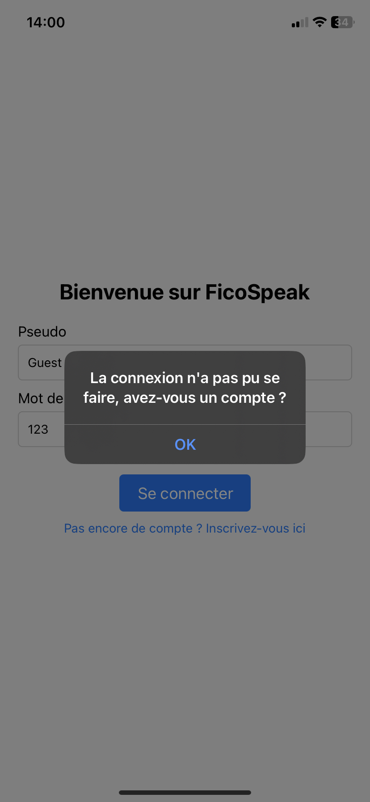

Ce que je montre à l'utilisateur est une alerte qui l'informe que la connexion n'a pas pu se faire.
Et je lui demande s'il a un compte ou pas.

### Communication avec un Service Web

Pour cette partie, on va passer à l'accueil principal de l'application.
Donc à ce moment, l'utilisateur est connecté.
Ca signifie donc que ses données sont stocké dans la base de données **MongoDB**.

  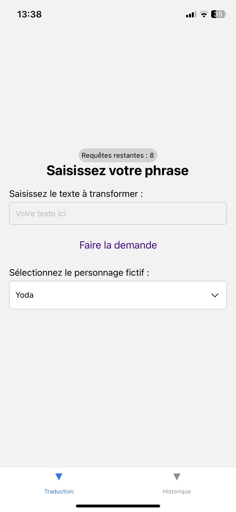

L'utilisateur se retrouve devant cette écran.
Dans cette écran, on retrouve principalement une entré de texte pour que l'utilisateur puisse taper sa phrase à transformer.
Il y a un lien avec le texte **Faire la demande** qu'il pourra utilisé pour transformer la phrase.
Et enfin, on retrouve un sélecteur déroulant pour sélectionner le personnage qu'on désire.
Le choix de personnage est important car c'est ce personnage fictif qui va parler.

Lorsque l'utilisateur appuis sur le bouton **Faire la demande**, à ce moment je contacte **FUN TRANSLATIONS API**. pour qu'il transforme cette phrase.
On déduit alors que l'utilisateur doit pouvoir contacter Internet pour qu'il puisse envoyer une requête.
Cette API a un taux de requête maximum qu'on ne peut pas dépasser.
On ne peut faire que 10 requête par heure ce qui est très peu.
C'est pour cela qu'à l'écran d'accueil, on retrouve en haut le nombre de requête restante. Chaque heure, ce chiffre est incrémenté.

Par exemple, transformons la phrase suivante comme si Yoda l'avait dit : 
**Obiwan has been the most powerfull Jedi**

  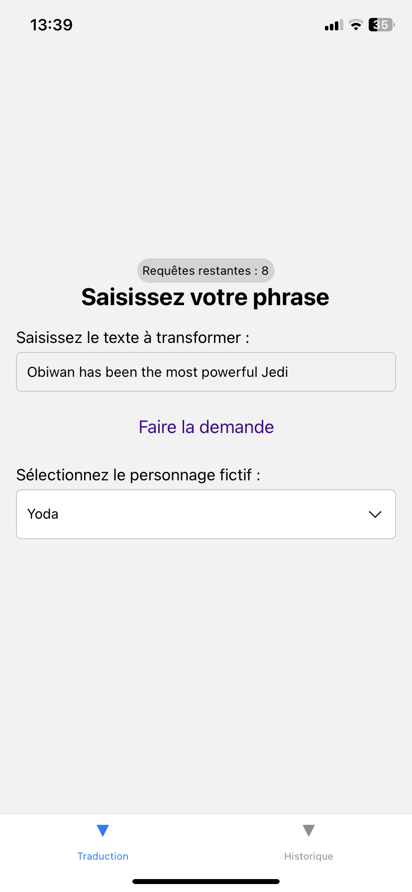
  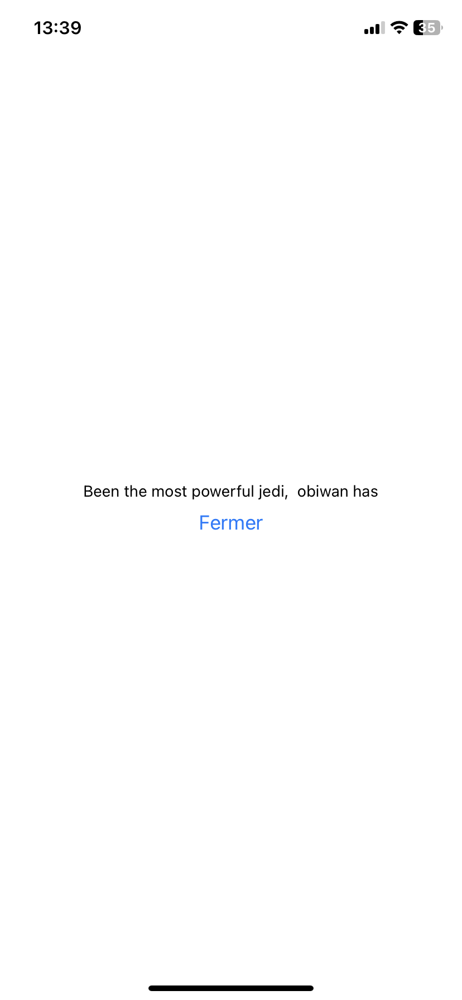

Comme on peut le voir, la phase est transformé en : 
**Been the most powerfull jedi, obiwan has**

On constate donc que la phrase est transformé comme si Yoda l'avait dit.
Lorsqu'on a finie de lire ce texte, on peut alors fermer la page et on retourne à l'accueil.

Pour être plus prècis sur le composant que j'utilise pour montrer la phrase transformé.
Le composant que j'utilise se nomme un **Modal**.
Ce composant me permet notemment de montrer des informations mais il me permet surtout de montrer une brève information avec un lien cliquable pour fermer ce modal.
La manière dont il apparaît peut être changé. 
Dans mon cas, le composant apparaît en glissant de bas en haut.
Il existe d'autre manière d'apparaître bien sûr.

  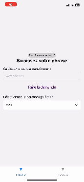

### Afficher l'histroique des textes transformées

our afficher l'historique des phrases transformées par l'utilisateur, j'ai opté pour l'utilisation d'un composant de type FlatList.
Lorsque l'utilisateur accède à cette page, il a la possibilité de visualiser la liste des phrases qu'il a demandé de transformer.
En sélectionnant l'une de ces phrases, un panneau s'ouvre, dévoilant la version transformée de la phrase. 
Voici l'aperçu de ce que l'utilisateur peut observer :

  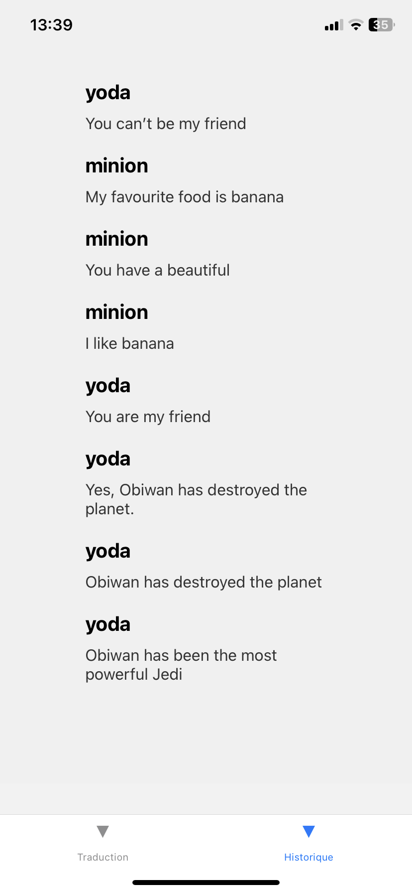
  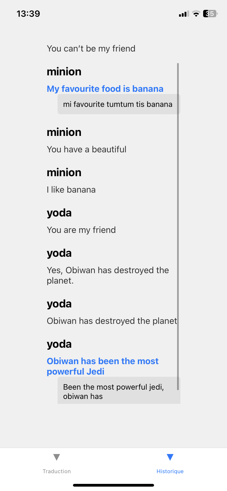

## Dernière amélioration

On m'a chargé de mettre en place des images visant à expliciter l'objectif de l'application pour les utilisateurs.
À cette fin, j'ai intégré une image spécifique.
Voici l'interface de connexion/inscription :

  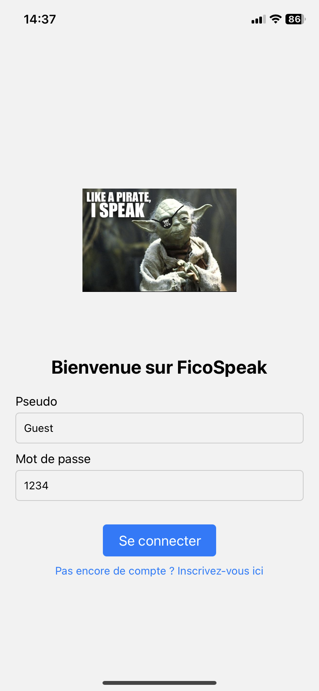

## Conclusion

En résumé, ce projet a pour objectif de mettre en avant l'efficacité de React Native dans la création d'applications mobiles interactives, combiné à une API personnalisée construite avec Node.js, Express.js et MongoDB.
Les fonctionnalités intégrées, qui englobent la navigation utilisateur, l'utilisation des périphériques, ainsi que l'interaction avec des services web, respecte le cahier de cherge.
